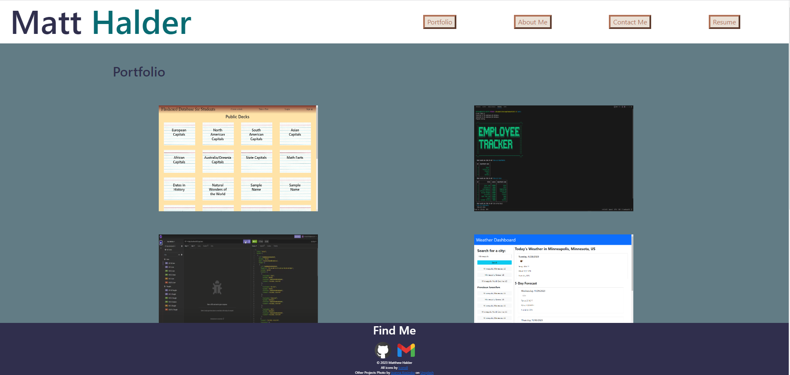

# React Portfolio	
## Description
This project is a portfolio of my work using React. React code is used to display everything by creating the components necessary for the webpage and display the correct items at the correct times with React Router. This project helps to show off my other work in a more visually appealing way than GitHub.
## Table of Contents
- [Installation](#installation)
- [Usage](#usage)
- [Credits](#credits)
- [License](#license)
- [Questions](#questions)
- [Tests](#tests)
## Installation
The pertinent files for the project, including this README can all be found in the Github repository located at: https://github.com/mhalder4/react-portfolio. The website can be found at the address that follows: https://cerulean-praline-17445a.netlify.app/.
## Usage
Once the page is opened, the user is shown a handful of projects I have completed. If they hover over and then click on one, they will see links to the GitHub repo for that project and either the project itself or a demo of the project. The user can also click on the buttons in the top right to navigate around the site. The About Me and Resume pages show some text while the Contact Me page has form fields that can be input in to send me a message (not yet implemented). There are also links to my GittHub profile and Gmail at the bottom of every page.

## Credits
My instructor, Gary Almes, gave some code on how to handle input in form fields in React.
## License
[MIT License](https://choosealicense.com/licenses/mit/)
MIT License

Copyright (c) 2023 Matthew Halder

Permission is hereby granted, free of charge, to any person obtaining a copy
of this software and associated documentation files (the "Software"), to deal
in the Software without restriction, including without limitation the rights
to use, copy, modify, merge, publish, distribute, sublicense, and/or sell
copies of the Software, and to permit persons to whom the Software is
furnished to do so, subject to the following conditions:

The above copyright notice and this permission notice shall be included in all
copies or substantial portions of the Software.

THE SOFTWARE IS PROVIDED "AS IS", WITHOUT WARRANTY OF ANY KIND, EXPRESS OR
IMPLIED, INCLUDING BUT NOT LIMITED TO THE WARRANTIES OF MERCHANTABILITY,
FITNESS FOR A PARTICULAR PURPOSE AND NONINFRINGEMENT. IN NO EVENT SHALL THE
AUTHORS OR COPYRIGHT HOLDERS BE LIABLE FOR ANY CLAIM, DAMAGES OR OTHER
LIABILITY, WHETHER IN AN ACTION OF CONTRACT, TORT OR OTHERWISE, ARISING FROM,
OUT OF OR IN CONNECTION WITH THE SOFTWARE OR THE USE OR OTHER DEALINGS IN THE
SOFTWARE.
## Questions
Find me on [GitHub](https://github.com/mhalder4)
## Tests
N/A

